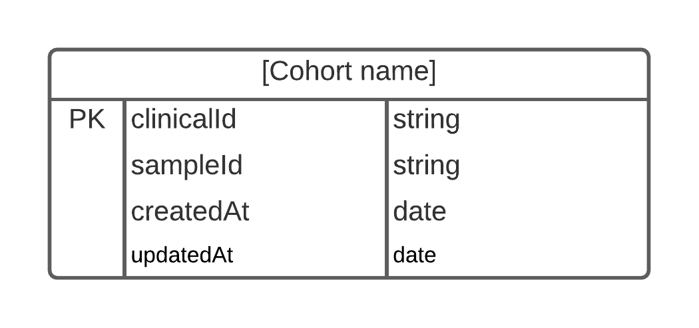

# Custodian DB + API
Note: the data in this isn't persistent, but it creates it all from the files on container start - if you make any adhoc changes they will NOT carry over. This is easy to change in the compose file, if you wish.
## Table of Contents
  * [Dev setup](#dev-setup)
    + [Clone the repo](#clone-the-repo)
    + [Bring up the services](#bring-up-the-services)
  * [Adding a cohort](#adding-a-cohort)
    + [1. Write a parser for cohort.pheno.json](#1-write-a-parser-for-cohortphenojson)
    + [2. Create a Sequelize model for the cohort](#2-create-a-sequelize-model-for-the-cohort)
    + [3. Update mappings.js](#3-update-mappingsjs)
    + [4. Create a seeder](#4-create-a-seeder)
    + [5. Rebuild container](#5-rebuild-container)
    + [Further steps](#further-steps)
  * [Removing a cohort](#removing-a-cohort)
    + [1. Remove the seeder file](#1-remove-the-seeder-file)
    + [2. Remove the migration file](#2-remove-the-migration-file)
    + [3. Remove the model file](#3-remove-the-model-file)
    + [4. Rebuild container](#4-rebuild-container)

## Dev setup
### Clone the repo
```
git clone https://github.com/gene-trustee/custodian.git && cd custodian
```
### Bring up the services
```
docker-compose up -d
```

Unlike Clinical, Custodian is very self contained and self-seeds the database.

If you run into issues, try starting only the DB, waiting for it to be fully running and then bringing up the API as the API could try to seed before the DB is ready for connections.

## Adding a cohort
Slightly less annoying that Clinical, but still an effort. Confusingly, I use two definitions of "Mapping". The first is a mapping between Sample ID and Clinical ID, e.g. the Custodian database is filled with _mappings_. The second definition is a mapping between an actual cohort name, and a Vectis internal cohort name, e.g. Acute care = acutecarepro. I'll try to mention which definition I'm using if it's not obvious from context.

### 1. Write a parser for cohort.pheno.json
This is a lot easier than Clinical, we just want to iterate over each patient and create a new object that fits the Sequelize model. The Sequelize model is simple, it just has a clinicalId, sampleId, createdAt and updateAt fields:
```ts
/**
 * @typedef {Object} Mapping
 * @property {string} clinicalId
 * @property {string} sampleId
 * @property {Date} createdAt
 * @property {Date} updatedAt
 */
 ```
 An example of a parser for MITO is:
 ```TS
 /**
 * @param {Array<Patient>} mitoInput
 * @returns {Array<Mapping>}
 */
module.exports = (mitoInput) => {
  /**
   * @type {Array<Mapping>}
   */
  var mappings = [];

  mitoInput.forEach((patient) => {
    let mapping = {
      clinicalId: patient.externalIDs,
      sampleId: patient.internalIDs,
      createdAt: new Date(),
      updatedAt: new Date(),
    };
    mappings.push(mapping);
  });
  return mappings;
};
```
### 2. Create a Sequelize model for the cohort
This is easy, just copy one of the exisiting files in the models folder (that is NOT `index.js`) and change the table and model name.

### 3. Create a Sequelize migration for the model
Again just copy one of the existing files in the migration folder and change the names to match your model.

### 3. Update mappings.js
Using the model name you just changed, add an Key/Value entry where K = the model name and V = the name used on Vectis to the file `helpers/mappings.js`.

### 4. Create a seeder
A lot easier than Clinical, again just copy an exisiting file in the seeders folder, and change the parser, file, and table name.

### 5. Rebuild container
On first start, the image runs the seeder command - no need to attach and run it yourself (though you could if you want).

### Further steps
Remember you also need to change Clinical, Patient-Discovery-BE and -FE.

## Removing a cohort
### 1. Remove the seeder file
Delete the file `seeders/[cohort]-mappings.js`
### 2. Remove the migration file 
Delete the file `migration/create-[cohort].js`
### 3. Remove the model file
Delete the file `models/[cohort].js`
### 4. Rebuild container
Database will be rebuilt and reseeded without the unwanted cohort.

## CI/CD
### Setup
Download the github self hosted run as per their [documentation](https://docs.github.com/en/actions/hosting-your-own-runners/adding-self-hosted-runners). Run the `./config.sh`, nothing special needs to be set here, so give it whatever name and accept the defaults provided.

### Production
Triggered on push to master, this will:

    1. Clone this repo to Holon
    2. Build the docker images listed in the compose file
    3. Bring them up.
It will also print some debug information 

### Staging
Triggered on a pull request, this will:

    1. Clone the branch to holon
    2. Build the docker images listed in the staging compose file
    3. Bring the images up with ports+1000 (e.g. 4000 on prod will be 5000)

## Database Schema
Each cohort is a table, each table has two columns of clinicalID and sampleID. Sequelize also enforces an extra two columns of createdAt and updatedAt. i.e., the database is populated by many:



This is a bit of a non-standard way of doing things, much more akin to NoSQL. The more traditional sense would have a table of cohorts, and have a table of mappings with a foreign key to the table of cohorts. However, Sequelize allows iterating over every table so I never bothered with the indirection. Feel free to change this to how you see fit.

## Docs
Docs are generated by apiDoc and are located in `apidocs`. They can be viewed by opening `apidocs/index.html`. They can be regenerated by [installing apiDoc](https://apidocjs.com/) and running `apidoc -i routes -o apidoc`.
